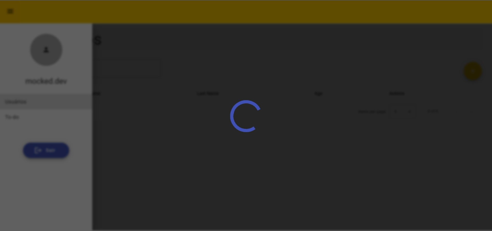

<div align="center">



</div>

<div align="center">

# dot-cecilia

</div>


### <div align="center"> Aplicação em Angular, abordando conceitos sobre: </div>

- [TypeScript](https://www.typescriptlang.org/) - Tipagens 
- [Angular](https://angular.io/) - Rotas | lazy loading | services | interceptors | components | guardas | Observables | dynamic forms | storage | classes | providers
- [Material Angular](https://material.angular.io/) - UI para agilidade no desenvolvimento
- [SASS](https://sass-lang.com/) - Pré processador CSS | modelo BEM
- [json-server](https://github.com/typicode/json-server) - Mock de backend
- [Formly](https://formly.dev/) - Montagem de formulários dinâmicos

## <div align="center">Requisitos</div>

Para executar a aplicação é necessário instalar algumas ferramentas tais como um editor de códigos para realizar compilação dos mesmos. Nesse projeto foi utilizado o [Visual Studio Code](https://code.visualstudio.com/), [NodeJS](https://nodejs.org/en/) para compilação do código, [Git Bash](https://gitforwindows.org/) para baixar o repositório e baixar todas as dependências necessárias. Necessário também instalar o [@angular/cli](https://angular.io/guide/setup-local#prerequisites) para instalar as dependências do angular

```bash
# Clone este repositório(caso ja tenha feito isso no passo anterior, pule para o próximo comando)
$ git clone <https://github.com/Ricnaga/angular-list>

# Acesse a pasta do projeto no terminal/cmd
$ cd angular-list

# Instale as dependências
$ yarn (ou npm -i)

# Inicie a aplicação sem mock
$ yarn start (ou npm run start ou ng serve)

# Inicie o servidor mock
$ yarn server (ou npm run server)

# Para iniciar os dois ao mesmo tempo
$ yarn dev (ou npm run dev)

# A aplicação abrirá automaticamente um navegador com o endereço <http://localhost:4200>
```